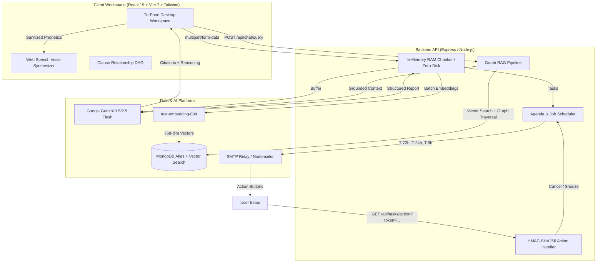

# LegalLens: Decision-Ready Document Intelligence Platform

> Transform dense, complex legal contracts into an interactive, decision-ready intelligence workspace.

LegalLens answers the critical questions traditional AI tools miss:
1. *"What does this mean for me financially and operationally?"*
2. *"What could happen under critical dispute, exit, or renewal scenarios?"*
3. *"Which clauses conflict, override, or trigger penalties across the contract?"*

---

## 🌟 Key Architecture & Non-Functional Guarantees

* **Zero Persistent File Storage:** Raw documents (`.pdf`, `.docx`, `.png`, `.jpg`) are processed strictly in an in-memory buffer (`multer.memoryStorage()`) and never written to disk or blob storage. Memory buffers are immediately wiped (`req.file.buffer = null`) post-embedding.
* **Document Authenticity & Forensic Verification Pipeline:** Detects tampering, digital splices, and fraudulent dates across 3 progressive in-memory audit layers:
  1. *Layer 1 (Computer Vision & ELA):* Sharp Error Level Analysis ($Q=95$), pixel-by-pixel delta matrix, and sliding window variance detection to spot Photoshop inserts and digit edits.
  2. *Layer 2 (Statutory & QR Scanner):* `@zxing/library` optical QR and 2D barcode decoding validating official state registries (StockHolding, GRAS Mahakosh, Kaveri, SRO) with OCR fallback.
  3. *Layer 3 (Semantic & Chronology Auditor):* Gemini legal reasoning enforcing the mandatory Indian Tenancy Chronology Rule ($\text{Stamp Purchase Date} \le \text{Execution Date} \le \text{Commencement Date}$), bilateral party reconciliation, and $\ge 2$ witness signatures.
  4. *Composite Scorer:* Computes weighted score $(0.25 \times S_{\text{Forensic}} + 0.40 \times S_{\text{Statutory}} + 0.35 \times S_{\text{Semantic}})$ with safety overrides.
* **Vector Persistence with Ephemeral TTL:** Structured clause extractions and 768-dimensional dense embeddings reside in **MongoDB Atlas Vector Search** with a 24-hour Time-to-Live (`TTL`) index for automatic expiration.
* **Graph-Augmented RAG Copilot:** Questions are answered via hybrid retrieval: vector search + 1-hop adjacency traversal over `connectedClauses` metadata, grounded with strict citations (`[Cl. X (p. Y)]`).
* **Client-Side Voice Player & Phonetic Sanitizer:** Converts answers to natural spoken audio via Web Speech Synthesis API, stripping Markdown syntax, formatting Rupee amounts into words (`₹20,000` $\rightarrow$ *"twenty thousand rupees"*), and converting citations into natural phrasing.
* **Automated Multi-Stage Deadline Scheduler:** Milestone deadlines are extracted into ISO timestamps and scheduled via **Agenda.js** and **Nodemailer** for 3 automated dispatches ($T - 72\text{h}$, $T - 24\text{h}$, $T - 5\text{h}$) with one-click HMAC resolution URLs.

---

## 🏗️ System Architecture & Data Flow



---

## 🛠️ Technology Stack

| Layer | Technology | Key Capabilities |
| :--- | :--- | :--- |
| **Frontend UI** | React 19, TypeScript, Vite 7 | Tri-Pane Workspace, Reactive Context, Radix UI, Lucide Icons |
| **Forensic Vision** | Sharp (^0.35.4) | In-memory Error Level Analysis ($Q=95$), raw RGB delta matrices, splice detection |
| **Barcode Scanner** | @zxing/library (^0.23.0) | Optical 2D QR / Data Matrix decoder with hybrid binarization for state e-Stamps |
| **Styling** | Tailwind CSS 4, Custom Modern CSS | High-contrast dark theme, glassmorphism, responsive canvas |
| **Voice / TTS** | Web Speech Synthesis API | Pre-TTS phonetic cleaner, sentence boundary sync (`onboundary`) |
| **Backend** | Node.js 20+, Express 4 | In-memory Multer, REST endpoints, SSE streaming, HMAC signatures |
| **AI Reasoning** | Google Gemini (3.5 / 2.5 Flash) | Structured JSON contract analysis, chronology validation, RAG copilot |
| **Embeddings** | `text-embedding-004` | 768-dimensional dense vector embeddings |
| **Database** | MongoDB Atlas | Ephemeral Vector Search (`$vectorSearch`), 24h TTL indexes |
| **Task Queue** | Agenda.js | MongoDB-backed job scheduler, automated email dispatches |
| **Email Relay** | Nodemailer | Responsive HTML email templates with one-click HMAC action URLs |

---

## 📁 Repository Structure

```text
.
├── backend/                       # Node.js / Express API (Render Target)
│   ├── src/
│   │   ├── config/
│   │   │   ├── db.js              # MongoDB Atlas connection & 24h TTL index init
│   │   │   ├── mailer.js          # Nodemailer SMTP transporter & preview logger
│   │   │   └── agenda.js          # Agenda scheduler & reminder jobs
│   │   ├── controllers/
│   │   │   ├── analyzeController.js    # In-memory upload, concurrent Gemini analysis & authenticity audit
│   │   │   ├── authenticityController.js # 3-layer authenticity verification orchestrator
│   │   │   ├── chatController.js       # Vector search + Graph RAG pipeline
│   │   │   └── taskController.js       # HMAC action validation & task state
│   │   ├── middleware/
│   │   │   ├── uploadMemory.js    # RAM-only Multer storage (25 MB max)
│   │   │   └── errorHandler.js    # Global API error interception
│   │   ├── models/
│   │   │   ├── AuthenticityAudit.js # Mongoose schema for authenticity_audits (24h TTL)
│   │   │   ├── VectorClause.js    # Mongoose schema for document_vectors (24h TTL)
│   │   │   └── TaskReminder.js    # Mongoose schema for task_reminders
│   │   ├── routes/
│   │   │   ├── documentRoutes.js  # /api/documents/* (/analyze, /verify-authenticity)
│   │   │   ├── chatRoutes.js      # /api/chat/*
│   │   │   └── taskRoutes.js      # /api/tasks/*
│   │   ├── services/
│   │   │   ├── forensicService.js # In-memory Sharp ELA & block variance calculator
│   │   │   ├── qrScannerService.js# ZXing optical QR & e-Stamp barcode extractor
│   │   │   ├── statutoryService.js# Gemini chronology & party reconciliation auditor
│   │   │   ├── geminiService.js   # Gemini 3.5/2.5 Flash & text-embedding-004 calls
│   │   │   ├── vectorService.js   # Atlas $vectorSearch & cosine fallback
│   │   │   ├── graphService.js    # 1-hop clause DAG adjacency traversal
│   │   │   └── notificationService.js # Responsive HTML email templates
│   │   └── utils/
│   │       ├── authenticityScorer.js # Composite weighted scorer (0-100) & badge generator
│   │       ├── ocrCleaner.js      # In-memory PDF (pdf-parse) & DOCX (mammoth) parser
│   │       └── tokenGenerator.js  # Cryptographic HMAC-SHA256 action tokens
│   ├── server.js                  # Express app initialization & port binding
│   ├── test-authenticity.js       # 27-test automated authenticity suite (100% pass)
│   ├── package.json
│   ├── render.yaml                # Render deployment configuration
│   └── .env.example
│
├── frontend/                      # React SPA (Vercel Target)
│   ├── client/
│   │   ├── src/
│   │   │   ├── components/        # Radix UI primitives & modals
│   │   │   ├── contexts/
│   │   │   │   └── DocumentContext.tsx # Central contract intelligence state & upload
│   │   │   ├── pages/
│   │   │   │   ├── Home.tsx       # Contract pulse, risk scorecard, ledger & copilot
│   │   │   │   ├── ClauseIntelligence.tsx # Search, risk filters & plain-read inspector
│   │   │   │   ├── ClauseGraph.tsx # Interactive Clause Relationship DAG
│   │   │   │   ├── Reminders.tsx  # Deadline radar, completion toggle & task modal
│   │   │   │   └── Settings.tsx   # Workspace preferences & privacy promise
│   │   │   ├── services/
│   │   │   │   └── api.ts         # Axios API client configured for backend proxy
│   │   │   ├── utils/
│   │   │   │   └── speechSanitizer.ts # Pre-TTS phonetic currency & citation cleaner
│   │   │   └── App.tsx            # App shell & interactive in-memory dropzone modal
│   │   └── public/                # Static assets
│   ├── vite.config.ts             # Vite configuration with /api backend proxy
│   ├── package.json
│   └── tsconfig.json
│
├── spec.md                        # Product & technical specifications
├── design.md                      # System & UI design documentation
├── test.md                        # Comprehensive automated & manual QA testing guide
└── README.md
```

---

## 🚀 Getting Started Locally

### Prerequisites
* **Node.js**: v20 or newer
* **npm**: v10 or newer
* **Google Gemini API Key**: from [Google AI Studio](https://aistudio.google.com/)
* **MongoDB Atlas URI**: connection string with Vector Search support

---

### Step 1: Clone and Configure Backend

```bash
cd backend
cp .env.example .env
```

Open `backend/.env` and provide your credentials:
```env
PORT=5000
NODE_ENV=development
BASE_URL=http://localhost:5000
FRONTEND_URL=http://localhost:3000

# MongoDB Atlas
MONGODB_URI=mongodb+srv://<username>:<password>@cluster0.mongodb.net/?appName=Cluster0

# Google Gemini API
GEMINI_API_KEY=your_gemini_api_key_here
GEMINI_MODEL=gemini-3.5-flash

# SMTP Email Relay (Optional in dev: logs preview URLs to console)
SMTP_HOST=smtp.gmail.com
SMTP_PORT=587
SMTP_USER=notifications@legallens.ai
SMTP_PASS=your_app_password

# HMAC Security Token
JWT_SECRET=legallens_super_secure_hmac_secret_key_minimum_64_characters_recommended
```

Install backend dependencies and start the development server:
```bash
npm install
npm run dev
```

The backend starts on `http://localhost:5000`. Health check: `http://localhost:5000/api/health`.

---

### Step 2: Configure and Start Frontend

In a separate terminal:
```bash
cd frontend
npm install
npm run dev
```

Open your browser at **[http://localhost:3000](http://localhost:3000)**. The Vite dev server automatically proxies all `/api/*` requests to port `5000`.

---

## 🧪 Testing & Verification

For detailed test steps and pass criteria, refer to [`test.md`](test.md).

### 1-Command Automated Backend Test Suite
```bash
cd backend
npm test
```
Validates the health check, task retrieval, grounded RAG Copilot query, and cryptographic HMAC token verification.

### In-Memory Upload & Ingestion Test
```bash
cd backend
node test-analyze.js
```
Simulates uploading a rental contract, runs Gemini extraction, verifies 768-dim embeddings, and confirms zero-disk processing.

### Frontend Typecheck & Production Build
```bash
cd frontend
npm run check
npm run build
```
Confirms 0 TypeScript errors and builds client assets into `dist/public`.

---

## 📡 REST API Specifications

### 1. Document Ingestion & Analysis
* **`POST /api/documents/analyze`**
  * **Headers:** `multipart/form-data`
  * **Payload:** `file` (Buffer, max 25MB), `recipientEmail` (string)
  * **Response:** Returns contract intelligence report, DAG relationships, tasks, and parallel `authenticityAudit` metadata.

### 2. Document Authenticity & Forensic Verification
* **`POST /api/documents/verify-authenticity`**
  * **Headers:** `multipart/form-data`
  * **Payload:** `file` (Buffer, max 25MB), `sessionId` (optional string)
  * **Response:**
    ```json
    {
      "success": true,
      "sessionId": "sess_1788598373934_RisE-e9n",
      "score": 88,
      "verdict": "MODERATE_AUTHENTICITY_VERIFIED",
      "sourceType": "COMPRESSED_SCAN_OR_MESSAGING_APP",
      "badges": [
        { "label": "e-Stamp QR Verified", "status": "PASS", "details": "StockHolding Corp Cert #IN-MH90283746192837" },
        { "label": "Image Compression Integrity", "status": "PASS", "details": "Uniform ELA profile across clauses" },
        { "label": "Chronological Sequence", "status": "PASS", "details": "Stamp (12/02/26) precedes Signing (15/02/26)" },
        { "label": "Witness Verification", "status": "PASS", "details": "2 independent witnesses attested" }
      ],
      "auditReport": {
        "forensics": { "elaPassed": true, "tamperAlert": false, "avgCompressionDelta": 4.12, "maxCompressionDiscrepancy": 9.8 },
        "statutory": { "qrDetected": true, "registryDomain": "gras.mahakosh.gov.in", "certificateNumber": "IN-MH90283746192837", "stampAmountPaid": "₹500", "verified": true },
        "semantics": { "chronologySound": true, "stampDate": "2026-02-12", "executionDate": "2026-02-15", "partiesMatched": true, "witnessesFound": 2 }
      },
      "discrepancies": [],
      "flaggedIssues": ["EXIF metadata stripped (typical for WhatsApp/Telegram forwards)"]
    }
    ```

### 2. Grounded Graph Copilot
* **`POST /api/chat/query`**
  * **Payload:** `{ "sessionId": "sess_...", "question": "Can deposit be withheld for repainting?" }`
  * **Response:**
    ```json
    {
      "success": true,
      "answer": "Based on [CLAUSE 18 (Page 7)], deductions are strictly authorized for structural damages and unpaid dues beyond normal wear. Deducting for repainting is not authorized...",
      "citations": [{ "clauseId": "CLAUSE_18", "page": 7, "snippet": "..." }],
      "connectedClauses": ["CLAUSE_06", "CLAUSE_21"],
      "graphPath": ["CLAUSE_18", "CLAUSE_21"]
    }
    ```

### 3. Task Management & One-Click Actions
* **`GET /api/tasks`**: Returns scheduled tasks for active session.
* **`POST /api/tasks`**: Creates a manual milestone and schedules the 3-stage reminder sequence.
* **`PATCH /api/tasks/:id/toggle`**: Toggles task status between `COMPLETED` and `PENDING`.
* **`GET /api/tasks/action?taskId=...&action=done|snooze&token=...`**: Verifies HMAC signature, halts/reschedules Agenda jobs, and serves a styled confirmation page.

---

## 🚢 Production Deployment

### Backend (Render)
1. Link your repository in Render and choose **New Web Service**.
2. Set **Root Directory** to `backend`.
3. Build Command: `npm install`
4. Start Command: `npm start`
5. Configure Environment Variables matching `backend/.env.example`.

### Frontend (Vercel)
1. Import repository into Vercel and set **Root Directory** to `frontend`.
2. Framework Preset: `Vite`.
3. Add Environment Variable:
   ```env
   VITE_API_URL=https://your-backend-service.onrender.com
   ```
4. Deploy.

---

## 🔒 Privacy & Security Promise

* **RAM-Only Processing:** Contract files exist only in memory buffers during the execution of `/api/documents/analyze`.
* **Ephemeral Persistence:** Clause vectors and metadata expire automatically after 24 hours via MongoDB TTL indexes.
* **Cryptographic Links:** Email reminder actions use HMAC-SHA256 signatures with timing-safe comparison to prevent unauthorized state modifications.

---

## 📄 License

This project is licensed under the MIT License.
