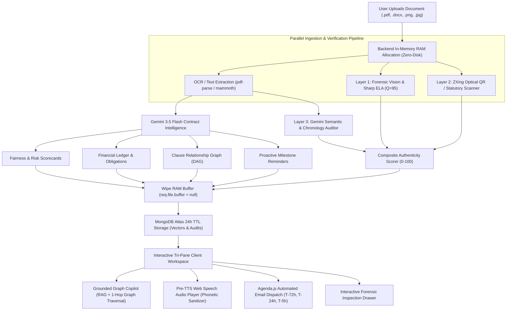

# `features.md` — LegalLens System Architecture & Complete Feature Guide

> Comprehensive operational documentation of how the LegalLens Document Intelligence & Forensic Verification Platform functions end-to-end.

---

## 1. Executive Summary & Core Philosophy

Legal documents (such as residential lease agreements, commercial contracts, service level agreements, and NDAs) are written in dense legalese that obscures critical financial risks, unilateral termination clauses, hidden penalties, and conflicting obligations. Furthermore, documents shared over messaging apps or mobile scanners frequently arrive stripped of metadata and vulnerable to digital tampering or date fraud.

**LegalLens** transforms these raw documents into an interactive, decision-ready intelligence workspace. It answers three fundamental questions:
1. *"What does this mean for me financially and operationally?"*
2. *"What could happen under critical dispute, exit, or renewal scenarios?"*
3. *"Which clauses conflict, override, or trigger penalties across the contract?"*

### Core Architectural Guarantees:
* **Zero Persistent File Storage:** Raw documents are never written to disk or cloud object storage. Uploaded buffers exist solely in volatile RAM and are dereferenced immediately post-analysis.
* **Ephemeral 24-Hour Lifecycle:** All extracted intelligence, vector embeddings, and audit reports are bound to 24-hour MongoDB TTL indexes and purged automatically.
* **Triple-Layer Document Authenticity:** In-memory computer vision, optical statutory QR decoding, and Gemini semantic chronology checks expose tampering, forged dates, or invalid e-Stamps.

---

## 2. End-to-End System Workflow



---

## 3. Feature Breakdown & Deep Dive

---

### Feature 1: Zero-Disk In-Memory Privacy Ingestion
* **Location:** [`backend/src/middleware/uploadMemory.js`](file:///d:/Project/Cybertron-Srijan/backend/src/middleware/uploadMemory.js), [`backend/src/utils/ocrCleaner.js`](file:///d:/Project/Cybertron-Srijan/backend/src/utils/ocrCleaner.js)
* **How it works:**
  1. Documents uploaded via `multipart/form-data` are intercepted by Multer configured with `multer.memoryStorage()`.
  2. The file is held strictly as a `Buffer` in the Node.js V8 process memory heap (max limit: 25 MB).
  3. Format-specific extractors parse the text without disk writing:
     * **PDF:** Parsed using `pdf-parse` directly from buffer streams.
     * **DOCX:** Extracted via `mammoth.extractRawText({ buffer })`.
     * **Images (PNG, JPEG, WebP):** Passed directly as raw pixel streams into `sharp` and Google Gemini.
  4. Immediately after intelligence extraction and embedding generation, the buffer is explicitly dereferenced:
     ```javascript
     req.file.buffer = null;
     ```
  5. If an unexpected error occurs at any point in the pipeline, error middleware intercepts the lifecycle and nullifies the buffer before terminating the request.

---

### Feature 2: Structured AI Contract Intelligence (Gemini 3.5 / 2.5 Flash)
* **Location:** [`backend/src/services/geminiService.js`](file:///d:/Project/Cybertron-Srijan/backend/src/services/geminiService.js), [`backend/src/controllers/analyzeController.js`](file:///d:/Project/Cybertron-Srijan/backend/src/controllers/analyzeController.js)
* **How it works:**
  1. Extracted document text or image buffers are sent to `gemini-3.5-flash` with strict schema validation (`responseMimeType: "application/json"`).
  2. The LLM extracts and returns:
     * **Document Classification:** Identifies contract archetype (e.g. *Residential Rental Agreement*, *Commercial Lease*, *NDA*, *MSA*).
     * **Fairness Score (0–100):** Evaluates whether the contract is balanced or heavily favors the counterparty (e.g., *Landlord-biased*).
     * **Risk Scorecard:** Quantitative exposure across four categories:
       - **Termination Risk (0–100%):** Notice periods, lock-in clauses, unilateral exit rights.
       - **Financial Risk (0–100%):** Rent escalations, late fees, penalty charges.
       - **Liability Risk (0–100%):** Indemnification breadth, damage clauses.
       - **Deposit Risk (0–100%):** Refund timelines, deductions, dispute conditions.
     * **Financial Ledger:**
       - **Fixed Commitments:** Recurring predictable expenses (e.g. monthly rent, one-time security deposit, maintenance).
       - **Contingent Liabilities:** Event-triggered fees (e.g. ₹20,000 penalty if 60-day notice is missed).
     * **Bilateral Obligations Matrix:** Categorizes exact duties for the User vs. the Counterparty, flagging one-sided or predatory requirements.
     * **Plain Language Translations:** Every clause is mapped with a 1-to-2 sentence plain-language interpretation explaining operational implications.

---

### Feature 3: Document Authenticity & Forensic Verification (3-Layer Audit)
* **Location:** [`backend/src/services/forensicService.js`](file:///d:/Project/Cybertron-Srijan/backend/src/services/forensicService.js), [`backend/src/services/qrScannerService.js`](file:///d:/Project/Cybertron-Srijan/backend/src/services/qrScannerService.js), [`backend/src/services/statutoryService.js`](file:///d:/Project/Cybertron-Srijan/backend/src/services/statutoryService.js), [`backend/src/utils/authenticityScorer.js`](file:///d:/Project/Cybertron-Srijan/backend/src/utils/authenticityScorer.js)
* **Specification:** Formally defined in [`authenticity.md`](file:///d:/Project/Cybertron-Srijan/authenticity.md).
* **How it works:**
  The system verifies mobile scans, compressed forwards, and digital PDFs across 3 progressive in-memory layers:

#### Layer 1: Computer Vision & Error Level Analysis (ELA)
* Recompresses the image buffer in RAM using `sharp` at a known quality factor ($Q = 95$).
* Calculates absolute pixel-by-pixel difference: $\Delta = (|R_1 - R_2| + |G_1 - G_2| + |B_1 - B_2|) / 3$.
* Runs a sliding window block variance detector ($64 \times 64$ px blocks).
* Detects localized splice halos, pasted signatures, or altered numerical digits (rent amounts/dates).
* Native digital vector PDFs are verified for stream integrity, font dictionaries, and compression consistency.

#### Layer 2: Statutory & Registry QR Scanner
* Preprocesses document pages (grayscale conversion, contrast binarization) and decodes 2D barcodes with `@zxing/library`.
* Validates decoded URLs against certified Indian government registries:
  - Stock Holding Corporation of India (`stockholding.com`, `shcilestamp.com`)
  - Government Receipt Accounting System (`gras.mahakosh.gov.in`)
  - Karnataka Kaveri (`karigr.gov.in`, `karnataka.gov.in`)
  - Inspector General of Registration (`igrmaharashtra.gov.in`, `delhi.gov.in`, etc.)
* Extracts Certificate Numbers (`IN-MH...`), GRN, and Stamp Duty amounts.
* **OCR Regex Fallback:** If the optical QR is degraded on low-res photocopies, regex scans document text to find printed certificate headers and SRO registration stamps.

#### Layer 3: Semantic & Chronology Auditor
* Enforces the mandatory Indian Tenancy Chronology Rule:
  $$\text{Stamp Purchase Date} \le \text{Execution Date} \le \text{Commencement Date}$$
* **Fraud Override:** Flags any document where stamp purchase date post-dates agreement execution as `CRITICAL_CHRONOLOGY_ANOMALY`.
* **Party Reconciliation:** Confirms that the e-Stamp purchaser matches Party 1 (Lessor) or Party 2 (Lessee) in the contract preamble.
* **Execution Verification:** Verifies execution recitals (*"IN WITNESS WHEREOF..."*), bilateral signatures, and $\ge 2$ independent witness attestations.

#### Composite Authenticity Scorer:
$$\text{Final Score} = (S_{\text{Forensic}} \times 0.25) + (S_{\text{Statutory}} \times 0.40) + (S_{\text{Semantic}} \times 0.35)$$

| Tier | Score Range | Verdict | Interpretation |
| :--- | :--- | :--- | :--- |
| **High Authenticity** | $90 - 100$ | `VERIFIED_VALID` | Government registry grounded; clean forensics; sound dates. |
| **Moderate (Scan/WhatsApp)** | $70 - 89$ | `MODERATE_AUTHENTICITY_VERIFIED` | Typical compressed forward; valid stamp/dates; uniform compression. |
| **Caution / Incomplete** | $40 - 69$ | `CAUTION_INCOMPLETE` | Missing second witness, degraded unverified stamp, or missing recital. |
| **High Risk (Tampered)** | $0 - 39$ | `HIGH_RISK_TAMPERED` | ELA splicing detected or stamp post-dates signing date. |

---

### Feature 4: Interactive Clause Relationship Graph (DAG)
* **Location:** [`backend/src/services/graphService.js`](file:///d:/Project/Cybertron-Srijan/backend/src/services/graphService.js), [`frontend/client/src/pages/ClauseGraph.tsx`](file:///d:/Project/Cybertron-Srijan/frontend/client/src/pages/ClauseGraph.tsx)
* **How it works:**
  1. Contracts are not linear documents; clauses condition, deduct from, trigger, or override other clauses across the contract.
  2. Gemini extracts directional edge dependencies between clauses (e.g. `CLAUSE_12` *(Early Termination)* $\xrightarrow{\text{TRIGGERS}}$ `CLAUSE_21` *(Penalty Fee)* and $\xrightarrow{\text{DEDUCTS}}$ `CLAUSE_18` *(Deposit)*).
  3. The frontend renders an interactive graph canvas featuring:
     * Node color-coding by risk (Coral = High, Amber = Medium, Lime = Low).
     * Solid lines for direct triggers and conditions; dashed lines for contingent dependencies.
     * Click-to-inspect node sidecar showing full text, connected upstream/downstream clauses, and risk score.

---

### Feature 5: Hybrid Graph-Augmented RAG Copilot
* **Location:** [`backend/src/services/chatController.js`](file:///d:/Project/Cybertron-Srijan/backend/src/controllers/chatController.js), [`backend/src/services/vectorService.js`](file:///d:/Project/Cybertron-Srijan/backend/src/services/vectorService.js)
* **How it works:**
  1. The user inputs natural language questions in the Copilot pane (e.g., *"Can the landlord deduct from my deposit for repainting?"*).
  2. The question is converted into a 768-dimensional dense vector using Google's `text-embedding-004`.
  3. **Hybrid Retrieval:**
     * **Vector Search:** Queries MongoDB Atlas `$vectorSearch` index matching clauses scoped to the current `sessionId`.
     * **1-Hop Adjacency Graph Traversal:** Looks up the `connectedClauses` metadata of the top vector matches, retrieving cross-referenced clauses that might not share exact semantic keywords.
  4. Context is passed to Gemini with strict citation formatting instructions.
  5. Responses strictly cite evidence in the format `[CLAUSE 18 (Page 7)]`, preventing LLM hallucination and enabling direct verification.

---

### Feature 6: Pre-TTS Phonetic Speech Sanitizer & Audio Player
* **Location:** [`frontend/client/src/utils/speechSanitizer.ts`](file:///d:/Project/Cybertron-Srijan/frontend/client/src/utils/speechSanitizer.ts), [`frontend/client/src/pages/Home.tsx`](file:///d:/Project/Cybertron-Srijan/frontend/client/src/pages/Home.tsx)
* **How it works:**
  1. Rather than feeding raw Markdown and legal jargon directly into the browser's TTS engine (which produces awkward readings like *"bracket capital C L dot eighteen bracket"*), LegalLens runs a **phonetic sanitization pipeline**:
     * **Currency Transformation:** Regex translates currency numbers into spoken words:
       `₹25,000` $\rightarrow$ *"twenty-five thousand rupees"*.
     * **Citation Conversion:** Translates bracketed citations into natural speech:
       `[Cl. 18 (p. 7)]` $\rightarrow$ *"according to clause eighteen on page seven"*.
     * **Syntax Stripping:** Removes bolding (`**`), italics (`*`), markdown bullet points, and code blocks.
  2. Dispatches synthesized audio through the browser's native `window.speechSynthesis` API.
  3. Listens to `utterance.onboundary` events to highlight spoken sentences and words in real time.

---

### Feature 7: Automated Multi-Stage Deadline Reminder Engine
* **Location:** [`backend/src/config/agenda.js`](file:///d:/Project/Cybertron-Srijan/backend/src/config/agenda.js), [`backend/src/services/notificationService.js`](file:///d:/Project/Cybertron-Srijan/backend/src/services/notificationService.js), [`backend/src/controllers/taskController.js`](file:///d:/Project/Cybertron-Srijan/backend/src/controllers/taskController.js)
* **How it works:**
  1. During ingestion, milestone dates (notice windows, renewal dates, inspection requests) are parsed into standardized ISO timestamps.
  2. **Agenda.js** registers three automated background reminder jobs in MongoDB for each task:
     * **$T - 72\text{h}$ (3 Days Before):** Early warning alert.
     * **$T - 24\text{h}$ (1 Day Before):** Urgent preparation alert.
     * **$T - 5\text{h}$ (5 Hours Before):** Critical final call.
  3. Dispatches responsive, dark-themed HTML emails via Nodemailer with contract context and penalty impact.
  4. **One-Click HMAC Action Links:**
     * Emails contain **"Mark as Completed"** and **"Snooze 24h"** buttons.
     * URLs are signed with cryptographic HMAC-SHA256 tokens (`/api/tasks/action?taskId=...&action=done&token=...`).
     * Users can complete obligations with one click directly from their email client on mobile or desktop without authenticating.

---

### Feature 8: Ephemeral 24-Hour TTL Privacy Architecture
* **Location:** [`backend/src/models/VectorClause.js`](file:///d:/Project/Cybertron-Srijan/backend/src/models/VectorClause.js), [`backend/src/models/AuthenticityAudit.js`](file:///d:/Project/Cybertron-Srijan/backend/src/models/AuthenticityAudit.js), [`backend/src/config/db.js`](file:///d:/Project/Cybertron-Srijan/backend/src/config/db.js)
* **How it works:**
  1. Legal documents contain sensitive financial figures, personal identities, and residential addresses.
  2. All collections storing session data (`document_vectors`, `authenticity_audits`) define MongoDB Time-to-Live indexes:
     ```javascript
     createdAt: {
       type: Date,
       default: Date.now,
       expires: 86400 // 24 hours in seconds
     }
     ```
  3. MongoDB Atlas automatically runs background thread workers that sweep and hard-delete expired documents 24 hours after ingestion, fulfilling complete privacy and zero-retention mandates.
